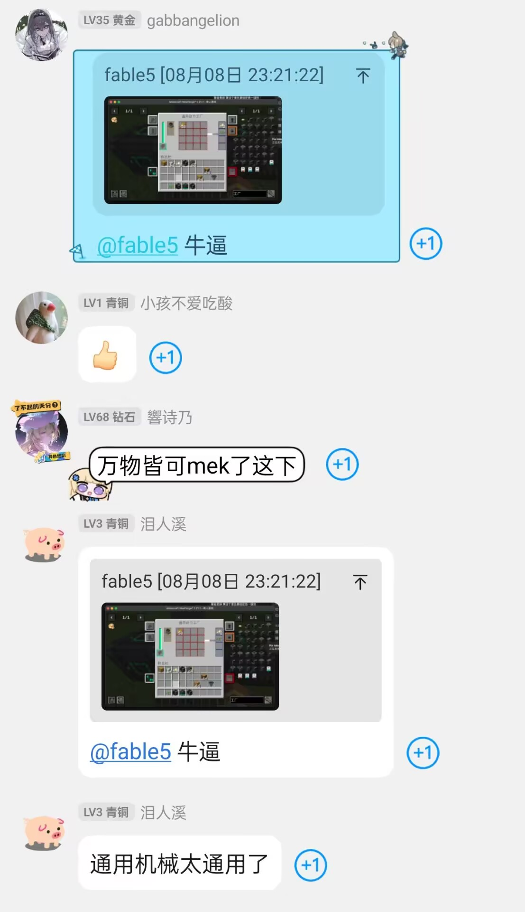
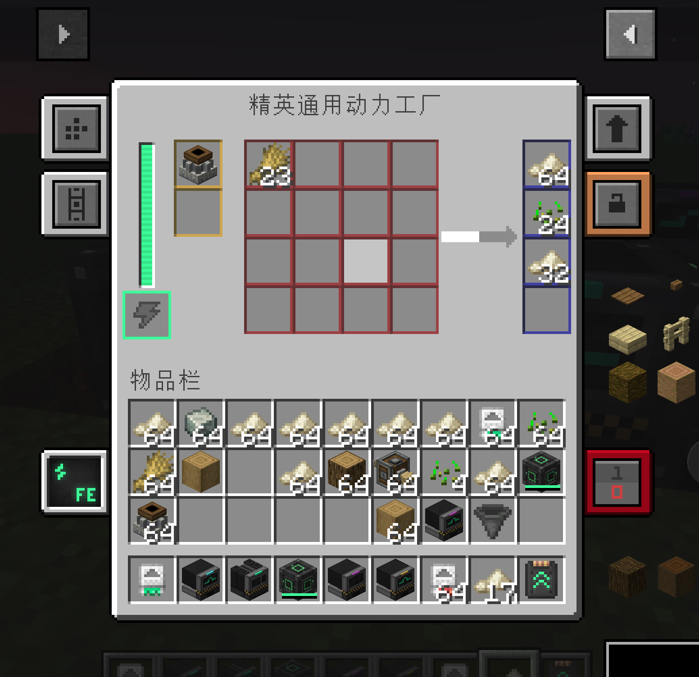
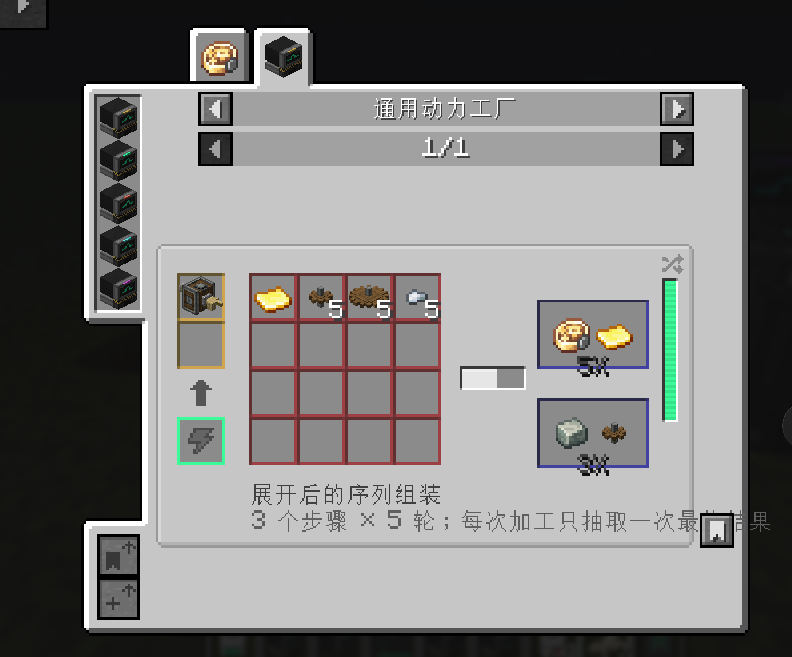

<div align="center">

# Mekanical Create · 通用动力

**把机械动力的物理产线，装进 Mekanism 风格的通用工厂。**

[](#运行环境)
[](#运行环境)
[](https://github.com/LangQi99/Mekanical-Create/releases/latest)
[](LICENSE)



<sub>“万物皆可 Mek”——来自玩家的真实反馈</sub>

</div>

---

## 这是什么？

**Mekanical Create（通用动力）** 是一个连接 [Create（机械动力）](https://github.com/Creators-of-Create/Create) 与 [Mekanism（通用机械）](https://github.com/mekanism/Mekanism) 的 NeoForge 附属模组。

它提供一套 Mekanism 风格的 **通用动力工厂**：把机械手、动力锯、动力冲压机、鼓风机等机械动力设备作为“加工模块”放入机器，即可使用统一的输入、输出、供能、升级和侧面配置系统完成对应配方。

> 不再为每种 Create 配方单独搭建一条产线，同时仍然读取 Create 的原始配方与序列组装规则。

## 界面预览

<div align="center">



<sub>精英通用动力工厂：16 格无序输入、4 格缓冲输出、独立能量槽与完整 Mekanism 侧面配置</sub>

</div>

## 核心功能

| 功能 | 说明 |
| --- | --- |
| 模块化加工 | 放入不同 Create 机器模块，自动启用相应配方目录 |
| 无序输入 | 材料只要放进 16 个输入槽即可，无需按合成形状或步骤排序 |
| 智能选方 | 多个配方同时匹配时，优先选择单次消耗材料更多、步骤更完整的配方 |
| 单次加工 | 每走完一次进度条，只执行一次配方，不会瞬间清空全部材料 |
| Mekanism 体系 | 原生 Mek 风格 GUI、FE 能量、升级、自动弹出和六面输入输出配置 |
| JEI 联动 | 工厂配方、催化剂、概率输出及序列组装信息均可在 JEI 中查看 |
| 附属兼容 | 自动发现依赖 Create 的附属模组机器与配方，并支持 KubeJS 注入的对应配方 |
| 机器音效 | 加工时播放 Mekanism 机器运作声，并支持消音升级 |

### 支持的 Create 加工模块

- **机械手**：普通机械手加工、物品应用，以及展开后的序列组装。
- **动力冲压机**：压片与冲压配方。
- **动力锯**：切割配方。
- **鼓风机**：搭配水、熔岩、灵魂篝火或普通篝火标记执行对应加工。
- **石磨与粉碎轮**：研磨、粉碎及概率副产物。
- **动力合成器**：原版工作台配方与 Create 动力合成配方。

物品应用配方也会按照 Create 自己的转换逻辑交给机械手执行，例如：

```text
去皮原木 + 安山合金 → 安山机壳
```

## 输入与配方选择

工厂把输入槽看作一个无序材料池。标签材料、同类替代品和分散在多个槽位中的同种物品都可以参与匹配。

当材料同时符合多个配方时，机器优先选择 **单次需求量更大的配方**。例如同时存在“2 个石头 → A”和“4 个石头 → B”，输入 8 个石头时会优先选择后者；一次进度只消耗 4 个石头并产出一次 B，剩余材料等待下一轮加工。

模块、鼓风条件和配方中声明为“不消耗”的工具只作为催化剂，不会被普通材料消耗逻辑扣除。

## 序列组装

<div align="center">



<sub>JEI 会显示展开后的步骤数、循环次数、总材料用量和加权概率输出</sub>

</div>

Create 的序列组装会被展开成工厂中的一次完整操作：

- 起始物品消耗 1 次。
- 机械手耗材按照循环次数自动合并并计算总量。
- 不消耗的工具保持为催化剂。
- 最终结果按照 Create 原配方的权重池抽取一次。
- 不会生成或暴露中间态的序列组装物品。

## 工厂等级

工厂可以使用 Mekanism 的工厂安装器逐级升级，升级时保留库存、能量、升级组件和侧面配置。

| 等级 | 灯带颜色 | 特点 |
| --- | --- | --- |
| 初始级 | 黄色 | 最低级通用动力工厂 |
| 基础级 | 绿色 | 基础 Mekanism 工厂等级 |
| 高级 | 红色 | 更高速度与能量容量 |
| 精英 | 青色 | 高性能工厂等级 |
| 终极 | 紫色 | 当前最高工厂等级 |

等级越高，加工速度、能耗与能量容量越高。速度、能量与消音升级均使用 Mekanism 原生升级系统。

## 流体多方块工厂

需要搅拌、压块、注液或排液时，使用可扩展的 **流体通用动力工厂**。长、宽、高均可在 3–7 格之间独立调整，由 Mekanism 原生多方块系统管理；拆散与重新成形时会通过共享缓存保留库存、流体与能量。

- 棱边和角落：全部使用 **通用动力工厂外壳**。
- 平整外墙：使用外壳或 Mekanism **结构玻璃**填满，玻璃是推荐方案。
- 控制器与端口：外壳上必须且只能放置 1 个控制器，并至少安装 1 个端口。
- 速度核心：放在内部，每个增加 25% 处理速度，最多 4 个。
- 能量核心：放在内部，每个增加 100 kFE 储能，最多 4 个。
- 流体核心：放在内部，默认已有 1 组流体槽；每个核心解锁 1 组输入与输出并提高容量，仅前 2 个核心生效、共最多 3 组流体槽。多放的核心不会阻止结构成型。
- 催化剂核心：默认提供 2 个催化剂槽；每个核心再解锁 2 格，仅前 3 个生效、共最多 8 格。
- 端口模式：配置器普通使用可查看模式，潜行使用可在 **黄色催化、红色输入、蓝色输出、绿色能源**之间切换。
- 红色输入端口接收原料和输入流体；黄色端口接收模拟机械与催化条件；蓝色端口导出物品与流体；绿色能源端口专门接收 FE。
- 成形：用空手右击控制器；成功后即可打开界面。

在 JEI 或物品栏中将鼠标悬停在控制器、外壳、端口或任意核心上并按住 `W`，可打开 7×7×7 分层搭建动画。

普通无流体通用动力工厂仍然是单方块机器，不受这套结构影响。

## 运行环境

| 依赖 | 版本 |
| --- | --- |
| Minecraft | 1.21.1 |
| NeoForge | 21.1.219 或更高的 21.1.x 版本 |
| Create | 6.0.10 |
| Mekanism | 10.7.19 |
| JEI | 19.x |
| Java | 21 |

## 安装

1. 安装 Minecraft 1.21.1 与对应版本的 NeoForge。
2. 安装 Create、Mekanism 和 JEI。
3. 从 [Releases](https://github.com/LangQi99/Mekanical-Create/releases/latest) 下载最新的 `mekanicalcreate-*.jar`。
4. 将 JAR 放入游戏实例的 `mods` 文件夹后启动游戏。

## 开发构建

```bash
./gradlew build
./gradlew runClient
```

项目通过公开依赖引用 Create 与 Mekanism，不会将两者的源码或资源直接打包进本模组。运行时使用的 Mekanism 模型、贴图、GUI 与音效仍遵循其各自项目的许可协议。

## 许可证

Mekanical Create 使用 [MIT License](LICENSE) 开源。Create 与 Mekanism 的内容仍分别受其自身许可证约束。
